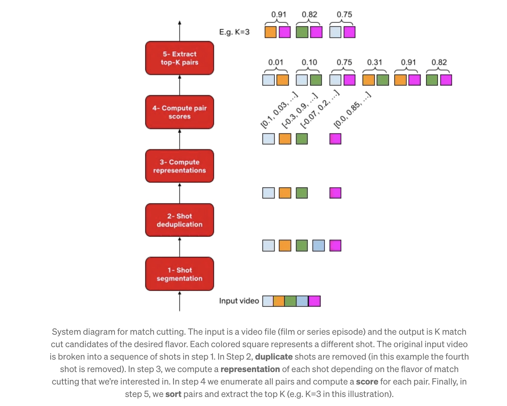

# Video Analysis Toolkit 🎥

This repository contains Python scripts for various video analysis tasks, including shot segmentation, image deduplication, scene visualization, optical flow comparison, and optical flow representation. These tools provide a foundation for working with video and image data, enabling tasks like content-based indexing, video summarization, and motion analysis.

## Contents

1. **shot_segmentation.py** - Performs shot segmentation on a video file using the `scenedetect` library.
2. **deduplication.py** - Identifies and removes near-duplicate images from a folder using cosine similarity.
3. **visualize_scene_cuts.py** - Visualizes scene cuts by saving middle frames of each detected scene.
4. **compare_optical_flow.py** - Compares optical flow images to detect similar motion patterns.
5. **optical_flow_representation.py** - Generates and visualizes optical flow representations from video frames.

---

### 1. 📽️ Shot Segmentation: `shot_segmentation.py`

This script uses the `scenedetect` library to detect shot boundaries in a video file, identifying key transitions between scenes.

**Functionality**:
- **Initialization**: Sets up video and scene managers, adds a content detector, and configures video downscaling for faster processing.
- **Shot Detection**: Identifies scenes based on content changes (e.g., colors, edges).
- **Output and Saving**: Saves detected scenes in `scene_list.pkl` and prints scene boundaries.

**Use Cases**:
- Video analysis, content indexing, video summarization, and automated editing.

---

### 2. Image Deduplication: `deduplication.py`

`deduplication.py` removes near-duplicate images by calculating cosine similarity between image embeddings generated by a pre-trained EfficientNet model.

**Functionality**:
- **Feature Extraction**: Loads images from `scene_cuts` and extracts feature vectors.
- **Similarity Calculation**: Uses cosine similarity to compare image pairs.
- **Duplicate Removal**: Deletes images with a similarity score above the set threshold.

**Use Cases**:
- Cleaning datasets, reducing storage, and improving dataset quality for machine learning tasks.

---

### 3. Scene Visualization: `visualize_scene_cuts.py`

This script loads scene boundaries from `scene_list.pkl` and saves the middle frame of each scene, providing a visual representation of shot boundaries.

**Functionality**:
- **Scene Loading**: Reads scene boundaries.
- **Frame Extraction**: Captures the middle frame for each scene.
- **Saving**: Saves each frame as an image in `scene_cuts`.

**Use Cases**:
- Scene visualization, video editing, thumbnail generation, and scene-based analysis.

---

### 4. Optical Flow Comparison: `compare_optical_flow.py`

`compare_optical_flow.py` compares optical flow images by calculating cosine similarity between flattened flow representations to identify similar motions.

**Functionality**:
- **Image Reading**: Loads optical flow images from `flow_folder`.
- **Flattening and Comparison**: Flattens images and calculates cosine similarity.
- **Similarity Detection**: Flags similar images based on a defined threshold.

**Use Cases**:
- Motion analysis, anomaly detection, and quality control for optical flow data.

---

### 5. Optical Flow Representation: `optical_flow_representation.py`

This script generates and visualizes optical flow representations from video frames, enabling the analysis of motion between consecutive frames.

**Functionality**:
- **Optical Flow Calculation**: Computes optical flow between pairs of frames using techniques such as Farneback or Lucas-Kanade.
- **Visualization**: Creates visual representations of motion directions and magnitudes, saving them as flow images.
- **Saving and Exporting**: Saves the visualized flow images to the specified output folder.

**Use Cases**:
- Analyzing motion patterns, understanding object trajectories, and identifying key motion events within videos.

---

## Key Points 🔑

- **Cosine Similarity**: Used across scripts for deduplication and motion analysis.
- **Threshold Adjustment**: Similarity thresholds are customizable to control sensitivity.
- **Deep Learning**: Leverages pre-trained models (e.g., EfficientNet) for feature extraction in deduplication.

---

## Acknowledgments

This project was inspired by concepts and techniques discussed in the paper [*Match Cutting at Netflix: Finding Cuts with Smooth Visual Transitions*](https://netflixtechblog.com/match-cutting-at-netflix-finding-cuts-with-smooth-visual-transitions-31c3fc14ae59) published on the Netflix Tech Blog. The methodologies described in this paper provided valuable insights into visual transition analysis and video segmentation, helping to shape the development of the shot segmentation and scene visualization tools in this repository.

*System diagram for match cutting. The input is a video file (film or series episode), and the output is K match cut candidates of the desired flavor.*
